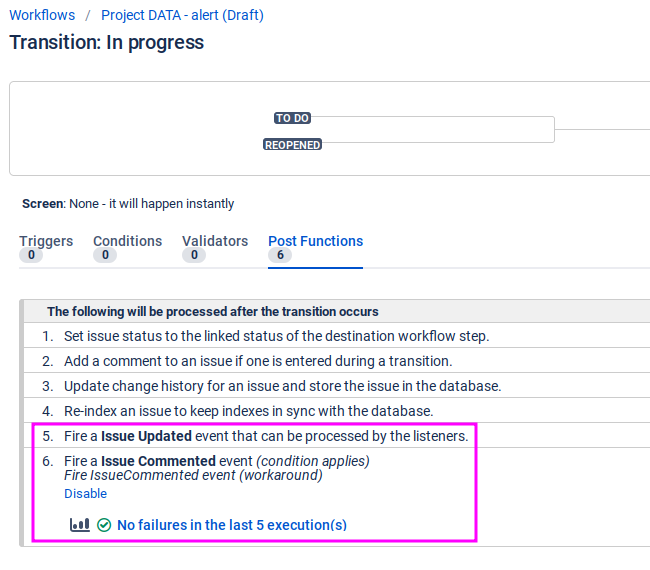
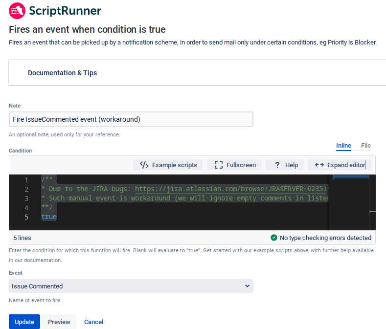

Layout, principles, context of such scripts is designed to be used in JIRA with ScriptRunner!

To ScriptRunner intended copying only directory [src/groovy/data]()

> ***WARNING*** Due to the JIRA bugs [JRASERVER-62351](https://jira.atlassian.com/browse/JRASERVER-62351) and [JRASERVER-59999](https://jira.atlassian.com/browse/JRASERVER-59999) to have work that solution properly you need to modify your workflow:
> 1. In each workflow transition in post-functions change GenericEvent to the concrete one like IssueCreated, IssueUpdated, IssueResolved and so on:  
> 2. Where second added event emmiter is of type " Fires an event when condition is true [ScriptRunner]" with condition:
> ```groovy
>  /**
> * Due to the JIRA bugs: https://jira.atlassian.com/browse/JRASERVER-62351 and https://jira.atlassian.com/browse/JRASERVER-59999 IssueComment is not triggered automatically.
> * Such manual event is workaround (we will ignore empty comments in listener).
> **/
> true
> ```
> and emits `IssueCommented` event (empty comments then skipped by integration listener. )